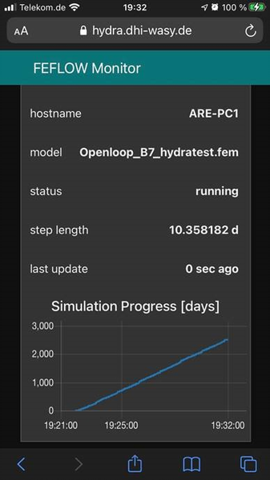

# feflow-monitor
A node-red based webservice to monitor the progress of FEFLOW model runs on a website.

**Description**

This service creates a web-site using [node-red](https://nodered.org) that allows monitoring multiple FEFLOW model runs on a single web-page.
The frontend is optimized for smartphone screens.

The service provides a REST API to which the progress data is send by the FEFLOW model using a http-get call in a call-back.

**Installation**

Installation requires a setup of [node-red](https://nodered.org).
The required node-red flows are provided as JSON files within this repository.

Once the service is running, open the website and copy the Python code from within its "???" tab, 
and paste it into the FEFLOW scripting menu. Adapt the script variables as needed, in particular make sure
that for each individual simulation running simultaneosly a uniqe channel is chosen.